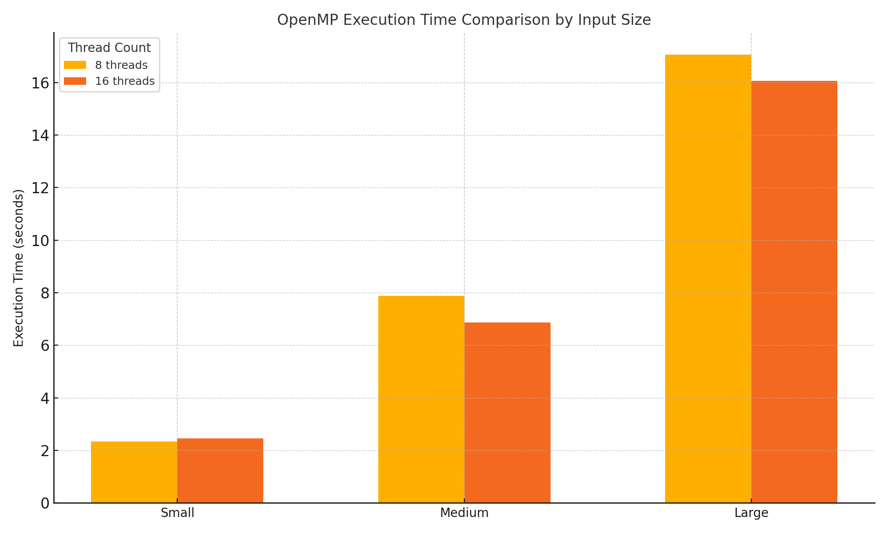

# Fast Matrix Exponentiation with Parallelization

#### Dragomir Andrei, Marinescu Alexandru, 343C1

# ⚠️ **NOTICE** ⚠️

### ⚠️ TO SEE THE README CORRECTLY  ⚠️

> In order to see the readme correctly access:
https://github.com/Dragomir1401/Paralel-number-of-paths-of-size-K.
---
> The archive was too big to include them as well.

---


## Overview

Let say we have n cities that are connected somehow to one another. If city A is connected to city B then we say that there is a road of length one between them, meaning it takes an hour to complete. We want to find out how many roads which would take k hours to complete are between any cities in the map. The naive solution would compute all the possible roads, but we have a better option.

This algorithm serves as a load balancer guide for very big maps in order to find out how many different ways we can route cars in order to avoid high traffic on long roads between multiple cities.

## Complexity

- **Time Complexity:**

$$ O(n^3 \times \log(k)) $$

- **Space Complexity:** 

$$ O(n^2) $$

### Proposal of solution

Our solution is to compute the power of the adjacency matrix of this graph of cities. But making that power of matrices will take a lot of time. For that we will use fast logarithmic exponentiation. We can do even better using parallel programming.

Let's say we want to find out all the roads which take 13 hours between some cities described by the matrix A.

**Matrix Powers:**

$$ A^{13} = A^8 \times A^4 \times A^1 $$
 $$ A^8 = A^4 \times A^4 $$
 $$ A^4 = A^2 \times A^2 $$
 $$ A^2 = A \times A $$

## Architecture used

**12th Gen Intel(R) Core(TM) i7-12700H 2.30 GHz**

### Use of Parallelism

We will use MPI to distribute the computation of each power described on a different MPI worker. The other point of improvement is doing the actual matrix multiplication on threads, MPI, or OpenMP workers. This way, we can optimize every part of the algorithm.

## Requirements

- **C++11** or later (for modern C++ features)
- **MPI** (Message Passing Interface) for distributed parallelization
- **OpenMP** for shared-memory parallelization
- **Make** for building the project

### Size of inputs

We have 3 different input sizes: small, medium, and large.

$$ small - 300 \times 300 $$
$$ medium - 450 \times 450 $$
$$ small - 600 \times 600 $$

All profiling tests have been run with 

$$ k = 10^{6} $$


## Compilation

To compile the project, you can use the provided `Makefile` in each directory by running:

```bash
make
```

```bash
./matrix <input_file> <power> <city_i> <city_j>
```

```bash
Where input file is: ../in/<size>.txt where size is small, medium, large.
Power is the size of the road we are targetting.
City i is the source.
City j is the destination.
```

## Pseudocode

```bash
Function multiply(a, b, n)
  result = n x n matrix of 0s
  For i, j, k in 0..n-1
    result[i][j] = (result[i][j] + a[i][k] * b[k][j]) % MOD
  Return result

Function matrixExponentiation(base, exp, n)
  result = identity matrix n x n
  While exp > 0
    If exp % 2 == 1, result = multiply(result, base, n)
    base = multiply(base, base, n)
    exp = exp // 2
  Return result

Main function
  If argument count < 5, Print "Usage" and Exit
  Read filename, k, city_i, city_j from arguments

  Open file filename
  If file cant be opened, Print "Error" and Exit

  Read n from file
  If city_i or city_j not in [0, n-1], Print "Invalid index" and Exit

  adjMatrix = n x n matrix from file
  resultMatrix = matrixExponentiation(adjMatrix, k, n)

  Print "Paths of length " + k + " between " + city_i + " and " + city_j + ": " + resultMatrix[city_i][city_j]
```
# Stage 1 - MPI Implementation

We will use MPI to parallelize the actual matrix multiplication by sending each process a piece of the matrix.

### Serial vs MPI time comparison


### MPI number of processes comparison


### MPI vs Pthreads vs Serial


# Stage 1 - OpenMP Implementation

### OpenMP times



### OpenMP vs Serial


### OpenMP vs MPI


# Stage 2 - Pthreads Implementation

We will use Pthreads to parallelize the matrix multiplication function. We will split the matrix into blocks and each thread will compute a block of the result matrix.

### Serial vs Pthreads time comparison


### Pthreads number of threads comparison


###  Stage 2 - Hybrid MPI - PThreads implementation

In order to further experiment with the possibility of using parallel programming for this problem, we implemented a hybrid solution combining MPI and PThreads. This implementation is designed to parallelize the computation of matrix exponentiation for determining the number of paths of size \( k \) between cities, represented in the adjacency matrix of the graph.

**Parallelization Approach:**

- **MPI:** Used to distribute the workload across multiple processes. Each MPI process computes a part of the matrix power, splitting the total exponentiation work among all available processes. Communication is facilitated using `MPI_Bcast` for broadcasting the adjacency matrix and `MPI_Send`/`MPI_Recv` for sharing partial results between processes.

- **PThreads:** Within each MPI process, threads are created to handle row-wise parallel matrix multiplication. Each thread operates on a subset of rows in the matrix to compute partial results, leveraging multi-core architectures.

**Implementation Highlights:**

1. **Matrix Multiplication with PThreads:**

   - Each thread calculates a range of rows in the resulting matrix.
   - Synchronization is ensured using `pthread_barrier_t` to maintain consistency during intermediate computations.

2. **Matrix Exponentiation:**

   - Implemented using repeated squaring. Each MPI process computes a local portion of the matrix power, utilizing PThreads for matrix multiplication in each step.

3. **Combining Results:**

   - After local computations, MPI processes send their results to the root process.
   - The root process combines the partial results using matrix multiplication to obtain the final matrix.

4. **Performance Optimization:**
   - Efficient division of work between MPI and PThreads minimizes communication overhead and optimizes resource utilization.
   - Modular arithmetic ensures no overflow occurs in large intermediate computations.

This hybrid implementation demonstrates the capability of MPI and PThreads to scale computations efficiently, addressing both inter-node and intra-node parallelism.

### Hybrid MPI - Pthreads vs Serial


## Time comparison between all implementations

- **Phtreads**

  

- **MPI**

  

- **Hybrid**

  

- **All versions**

  

- **Heatmap**

  

We can see how even compared to the enhanced hybrid version, the mpi with 8 processes beats their times with an important margin.

### **Maximum Parallelism Analysis Using Amdahl's Law**

To evaluate the theoretical and practical speedup achievable by our implementation, we use **Amdahl's Law**:

$$
S = \frac{1}{(1 - P) + \frac{P}{N}}
$$

Where:

- **S**: Speedup achieved.
- **P**: Proportion of the program that is parallelizable.
- **N**: Number of processing units (threads/processes).

---

### **Assumptions**

From profiling data, we estimate:

- **P ≈ 0.95** (95% of the workload is parallelizable).

---

### **Serial Execution Time**

The execution times for the serial implementation are:

- **Small**: 24.94 seconds
- **Medium**: 95.27 seconds
- **Large**: 220.89 seconds

---


### **Observed Speedup**

#### **Pthreads Speedup**

Using the formula:

$$
S = \frac{\text{Serial Time}}{\text{Parallel Time}}
$$

- **Small Matrix**:

  - 8 threads:
  
$$
S = \frac{24.94}{2.18} \approx 11.44
$$

  - 16 threads:
  
$$
S = \frac{24.94}{2.23} \approx 11.18
$$

- **Medium Matrix**:

  - 8 threads:
  
$$
S = \frac{95.27}{6.65} \approx 14.33
$$

  - 16 threads: 
  
$$
S = \frac{95.27}{6.42} \approx 14.84
$$

- **Large Matrix**:
  - 8 threads: 
  
$$
S = \frac{220.89}{13.61} \approx 16.23
$$

  - 16 threads:
  
$$
S = \frac{220.89}{14.92} \approx 14.80
$$

#### **MPI Speedup**

Using the same formula:

- **Small Matrix**:

  - 8 processes:
  
$$
S = \frac{24.94}{1.24} \approx 20.11
$$

  - 16 processes:
  
$$
S = \frac{24.94}{2.66} \approx 9.38
$$

- **Medium Matrix**:

  - 8 processes: 
  
$$
S = \frac{95.27}{3.42} \approx 27.87
$$

  - 16 processes:
  
$$
S = \frac{95.27}{5.35} \approx 17.81
$$

- **Large Matrix**:

  - 8 processes: 
  
$$
S = \frac{220.89}{7.88} \approx 28.05
$$
  
  - 16 processes:
  
$$
S = \frac{220.89}{10.97} \approx 20.14
$$

---

### **Revised Theoretical Speedup for MPI**

From **Large Matrix, 8 Processes**:

$$
S = 28.05, \quad P = 1 - \frac{1}{S}
$$

$$
P = 1 - \frac{1}{28.05} \approx 0.964
$$

Substituting \( P = 0.964 \):

$$
S_{\text{max}} = \frac{1}{1 - P} = \frac{1}{1 - 0.964} \approx 27.78
$$

---

### **Observations**

- **Pthreads**: Diminishing returns as the number of threads increases, likely due to overhead from thread creation and memory contention.
- **MPI**: Displays better scalability but suffers from communication overhead for large process counts, particularly when exceeding physical core count.

